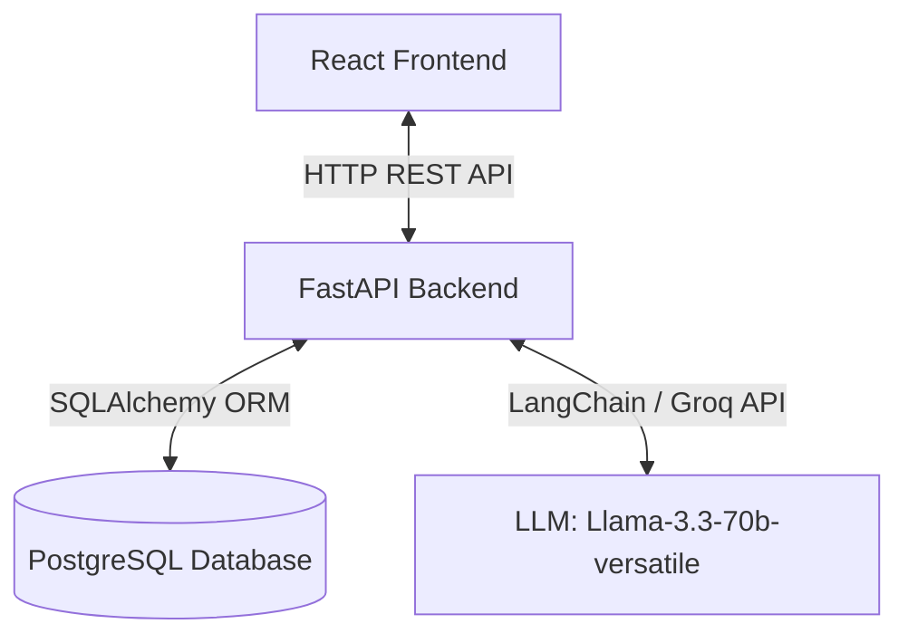
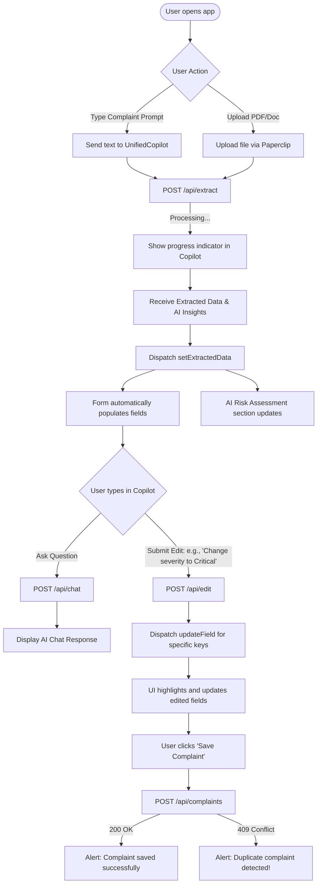
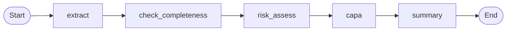

# System Architecture & AI Workflow Explanation

This documentation explains the complete system architecture, codebase flow, frontend workflow, LangGraph agent design, and key design decisions implemented for the AI-Powered Customer Complaint Management System.

---

## 1. Code Flow & Overall Architecture

The application is split into a **React/Redux** Single Page Application (SPA) frontend and a **FastAPI** backend that communicates with a **PostgreSQL** database.

### File Structure & Responsibilities
- **Frontend (`/frontend`)**:
  - `src/App.jsx`: Root component orchestrating the left/right split layout.
  - `src/components/UnifiedCopilot.jsx`: Unified chat sidebar that accepts text prompts, file uploads (PDF/DOCX/TXT/EML), and subsequent edit instructions.
  - `src/components/ExtractionForm.jsx`: The manual logging form which dynamically displays extracted fields and the AI Risk Assessment section at the bottom.
  - `src/store/`: Redux store slices (`complaintSlice.js`, `chatSlice.js`) for global state management.
  - `src/index.css`: Pure Vanilla CSS implementation managing layouts, custom fonts, dark/light visual hierarchies, and transition animations.
- **Backend (`/backend`)**:
  - `main.py`: Entrypoint containing REST routes (`/api/extract`, `/api/chat`, `/api/edit`, `/api/complaints`).
  - `agent.py`: Houses the LangGraph workflow pipeline, state definition, and LLM orchestration.
  - `models.py` & `database.py`: Define DB schemas and handle session connections to PostgreSQL via SQLAlchemy.
  - `utils.py`: Extracts raw text from incoming files (`.pdf`, `.docx`, `.txt`, `.eml`).

---

## 2. Frontend Workflow

The frontend is built for immediate visual feedback. It guides the user from an uninitialized chat interface to a fully-populated QA complaint form.

### Block Diagram

---

## 3. LangGraph Implementation

The AI pipeline is modeled as a state machine using **LangGraph**. A shared state dict (`ComplaintState`) is updated sequentially by five nodes before returning the final response.

### The Workflow Nodes Explained

1. **`extract` (Extraction Node)**:
   - **Action**: Receives raw text from the document or user prompt.
   - **Prompt**: Instructs the LLM to map raw paragraphs into a structured JSON structure representing database fields. 
   - **Edge Case Rules**: Defaults date to today's date if missing. Auto-infers initial severity and priority based on text description. Fills missing optional data with `"Not Specified"`.
2. **`check_completeness` (Completeness Checker Node)**:
   - **Action**: Evaluates the output of the extraction node.
   - **Rules**: Checks if the required regulatory fields (`product_name`, `batch_lot_number`, `detailed_description`) are present. Flags missing fields to alert the QA engineer in the UI.
3. **`risk_assess` (Risk Classification Node)**:
   - **Action**: Examines the detailed complaint description.
   - **Rule**: Prompts the LLM to output exactly a single word (`Critical`, `Major`, or `Minor`) classifying the risk level. This is displayed at the bottom of the complaint form.
4. **`capa` (CAPA recommendations Node)**:
   - **Action**: Analyzes the defect.
   - **LLM Output**: Suggests initial Root Cause analysis (using 5-Why or Ishikawa structures) and recommends immediate Corrective and Preventive Action (CAPA) steps.
5. **`summary` (Executive Summary Node)**:
   - **Action**: Summarizes the entire complaint into a concise, professional, single-paragraph overview.

---

## 4. Key Design Decisions

### A. ChatGPT-Style Unified Input
* **Problem**: Early iterations split the sidebar into a file uploader box, a text area, and a chat field, making the layout cluttered.
* **Solution**: Replaced them with a single input container containing a paperclip 📎 upload button. If the user hasn't submitted a complaint yet, typing or uploading triggers `/api/extract`. Once a complaint is loaded, the input switches dynamically to allow both question-answering and targeted editing instructions.

### B. JSON Mode vs Tool-Calling for Groq
* **Problem**: The default `with_structured_output(Schema)` uses tool-calling protocols under the hood. On Groq models (like `llama-3.3-70b-versatile`), this frequently triggered:
  `model output must contain either output text or tool calls, these cannot both be empty`.
* **Solution**: Switched to `with_structured_output(Schema, method="json_mode")`. We explicitly instruct the LLM in the system prompt to return valid JSON, completely bypassing the unstable tool-calling layer and producing 100% reliable extractions.

### C. Contextual Form Editing via Chat
* **Problem**: If the AI makes a slight error during PDF extraction, or if the user wants to adjust a value, forcing them to edit the fields manually in the form breaks the "Copilot" experience.
* **Solution**: Implemented `/api/edit`. When the user types an instruction like *"Change severity to Critical"*, the LLM compares the current form state against the request, returns only the updated key-value pairs (e.g. `{"initial_severity": "Critical"}`), and the Redux state applies them in real-time.

### D. Duplicate Detection
* **Problem**: Double-submitting the same PDF or prompt registers multiple duplicate complaints, polluting the database.
* **Solution**: Before committing records to PostgreSQL, `/api/complaints` runs a query filtering by `product_name` + `batch_lot_number` + `complaint_type`. If a match exists, it rejects the insert and sends a `409 Conflict` response with the ID of the existing record, which the frontend alerts.
